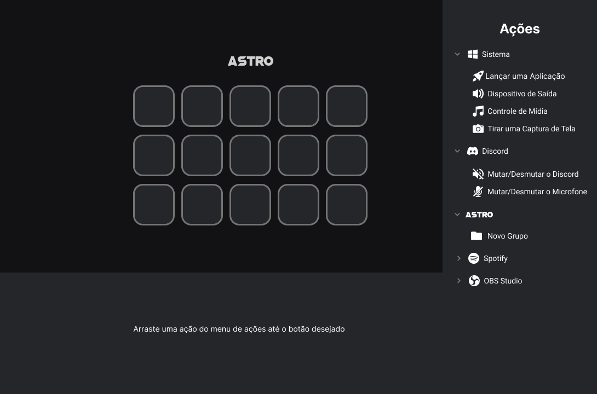

  

<h1 align="center">
  Astro Desktop
</h1>

O Projeto Astro é um conjunto de softwares que auxilia streamers no gerenciamento de suas transmissões ao vivo. Ele é uma alternativa gratuita e open source ao Elgato Stream Deck.

### Layout
O layout da aplicação desktop está disponível no Figma e pode ser acessado [clicando  neste link](https://www.figma.com/file/1qch0e7ZdzlVo6RCibqn75/Layouts?node-id=417%3A2)

 

 

🚧 **Este projeto encontra-se atualmente em desenvolvimento** 🚧

 
Made with love by Vine :purple_heart: